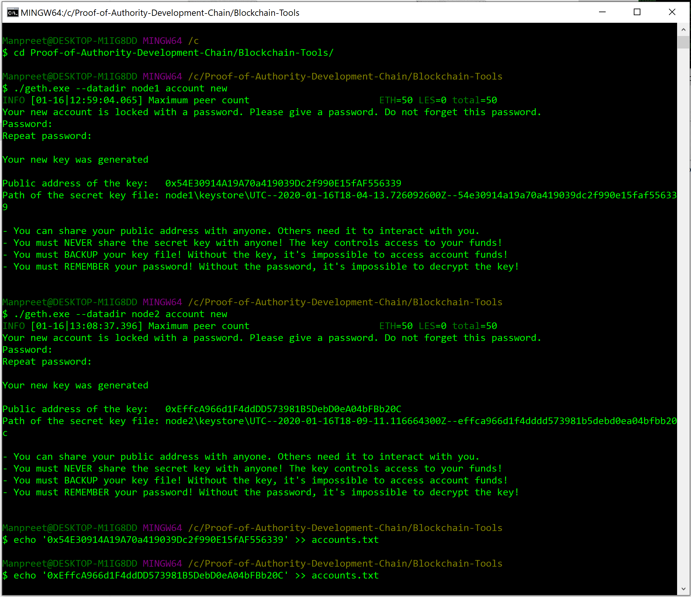

# Proof-of-Authority-Development-Chain

## Network Setup

1. **Setting up Nodes**

    Run the following cammand line script to create Node1

    `$ ./geth.exe --datadir node1 account new`

    Save the public address and password of the node1 to be used later using the following command

    `$ echo 'node1 public address' >> accounts.txt`

    `$ echo 'node1 password' > node1/password.txt`

    Repeat the above for Node2. The password is used to unlock the nodes later.

    

2. **Setting up Genesis**
    After creating the nodes let's create the very first block called Genesis block, this will be define the rules needed to initiate the blockchain. Use the following command to start Puppeth app that eases the creation of this block. 

    `$ ./puppeth.exe`

## MyCrypto Setup

## Transactions