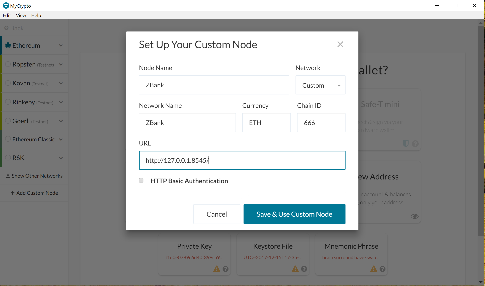

# Proof-of-Authority-Development-Chain

## Network Setup

1. **Setting up Nodes**

    Run the following cammand line script to create Node1

    `$ ./geth.exe --datadir node1 account new`

    Save the public address and password of the node1 to be used later using the following command

    `$ echo 'node1 public address' >> accounts.txt`

    `$ echo 'node1 password' > node1/password.txt`

    Repeat the above for Node2. The password is used to unlock the nodes later.

    

2. **Setting up Genesis**

    After creating the nodes let's create the very first block called Genesis block, this will be define the rules needed to initiate the blockchain. Use the following command to start Puppeth app that eases the creation of this block.

    `$ ./puppeth.exe`

    The following screenshots gives a walkthrough the process of genesis creation

    
    

    Please provide public addresses of the nodes created as sealers. Also provide them in the pre-funded settings along with any other Wallet Ids. Chain/Network Id is required and it has to be unique. This will be used to setup custom network in MyCrypto Wallet. Import the genesis configuration that will be used to initiate the nodes created. Exit the application once it is imported.

3. **Initiating and Start Nodes**

    Now the genesis configuration file is created let's initiate the nodes and start the nodes to mine. The following code is used to initiate the node based on the genesis configuration file

    `$ ./geth.exe init --datadir node1 networkname.json`

    

    Once this is done the nodes are ready to mine. Please run the following command targetting node1

    `$ ./geth.exe --datadir node1/ --mine --minerthreads 1 --syncmode 'full' --unlock 'node1publicaddress' --password node1/password.txt --rpc --allow-insecure-unlock`

    The following command is used to run node2

    `./geth.exe --datadir node2/ --rpcapi 'personal,db,eth,net,web3,txpool,miner' --bootnodes 'enode_path_for_node1' --port 30304  --syncmode 'full' --mine --minerthreads 1 --unlock 'node2publicaddress' --password node2/password.txt --allow-insecure-unlock --ipcdisable`

    The following describes the arguements passed in the above command line

    - ***--datadir*** : Data directory for the databases and keystore
    - ***--syncmode***: Blockchain sync mode ("fast", "full", or "light").'full' helps preventing the error Discarded Bad Propagated Block.
    - ***--mine*** : Enable mining
    - ***--minerthreads***: Number of CPU threads to use for mining (default: 0)
    - ***--unlock*** : Comma separated list of accounts to unlock.Specify Nodes public addresses.
    - ***--password***: Password file to use for non-interactive password input. The path points to the file containing the node password.
    - ***--rpc*** : Enable the HTTP-RPC server
    - ***--allow-insecure-unlock***: Allow insecure account unlocking when account-related RPCs are exposed by http.
    - ***--boootnodes*** : Comma separated enode URLs for P2P discovery bootstrap. In this case when node1 is started look for enode and copy set it to this arguement when starting other node(s).
    - ***--port**: Network listening port (default: 30303). This value has to be unique for each node in the network.
    - ***--rpcapi*** : API's offered over the HTTP-RPC interface. **Be mindful about hacks as everyone can call your RPC methods if no firewall is protecting your node.**
    - ***--ipcdisable***: Disable the IPC-RPC server. Only in case of windows.

    

## MyCrypto Setup

   Now the nodes are mining it is time to setup the custom network to check our nodes. Follow the steps to create and connect to custom network created

    
   
   

   Specify the exact Client Id that was specified while creating the genesis config file. If you don't remember what was set up it can looked up in ***networkname.json*** file. If you want to use the create a new network with same Chain ID then all the settings need to be deleted from the following location

   `C:\Users\yourusername\AppData\Roaming\MyCrypto\Local Storage\leveldb`
   `C:\Users\yourusename\AppData\Local\Ethash`

## Transactions

   Now MyCrypto wallet is connected to the custom netwrok let's connect to Node1 in the network and send a couple transactions to Node2 and one of the wallet IDs specified in Pre-Funded steps

   
   

    Specify Node1 password to unlock. It is same step as in the command line agruement.

   

   Specify Node2's public address in To Address and select the amount you want to send.

   

   Follow same steps for a Wallet Id

   